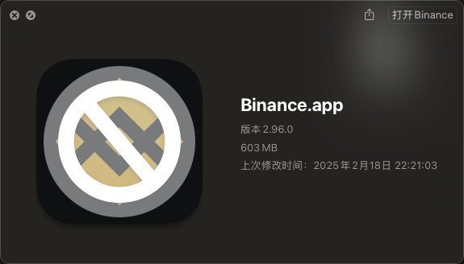
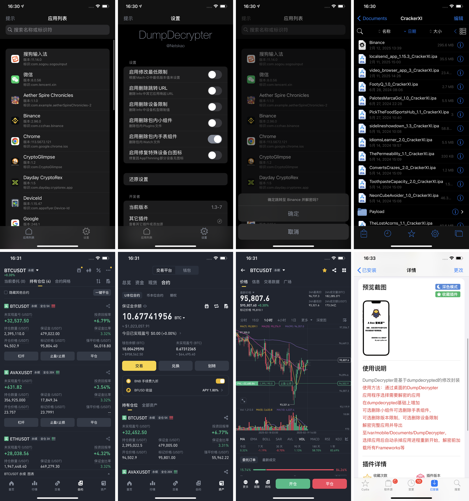

# binance-ios
最新版本V2.96.0 ios 币安客户端砸壳，逆向教程。

1: 最新版本币安是使用分布加载 Framework，所以使用 frida 和 其他砸壳工具会导致闪退和部分 Framework 无法砸壳，所以需要安装TZLoadAllLibs工具，自己 github 搜索，并安装依赖项目：applist
2：安装成功后再写自己的 Hook 核心实现，然后就可以无限修改币安金额以及数据，可以使用自己的个人证书实现免越狱手机安装。

